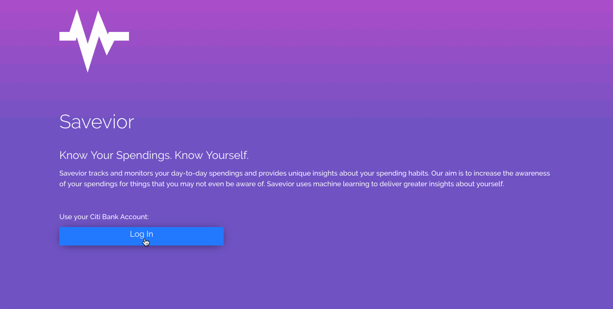
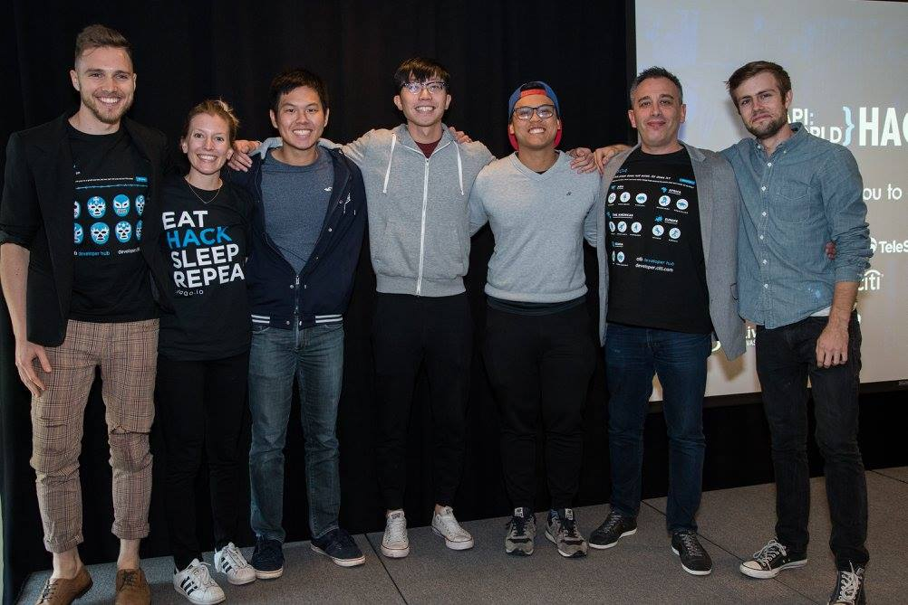

# Savevior

*This project was done during the
[2017 API World Hackathon](http://apiworld.co/hackathon/) and submitted
for [Citi Fintech's](https://developer.citi.com/) Challenge.*

## Introduction

Overspending is a problem many people face and it is what we at Savevior
want to tackle. Savevior tracks and monitors your day-to-day spendings
and provides unique insights about your spending habits in relation to
your sleep cycle, your physical activeness, and even the weather! Our
aim is to increase the awareness of your spendings in relation to your
psychological state to help user rationalize their decisions. Savevior
uses machine learning to deliver greater insights about yourself.

## Technology Stack

### Web/Data
* [Flask](http://flask.pocoo.org/) for the backend
* [Bootstrap](http://getbootstrap.com/) for the frontend
* [pandas](http://pandas.pydata.org/) and [numpy](http://www.numpy.org/)
for data processing
* Facebook's [Prophet](https://facebook.github.io/prophet/) for time
series analysis

### APIs
* [Fitbit API](https://dev.fitbit.com/)
* [Citi Fintech](https://developer.citi.com/)
* [Sleep as Android](http://sleep.urbandroid.org/documentation/developer-api/)
| Contact the project owner for access

## People

*Photo with the Citi Fintech Team*

### Team
[Ken Oung Yong Quan](https://kenoung.com) - **Backend Developer**

[Kiat Han Tan](https://www.linkedin.com/in/kiat-han-tan/) - **Frontend Developer/Biz**

[Samuel Chua Te Jie](https://samchuatj.wixsite.com/resume) - **Biz**